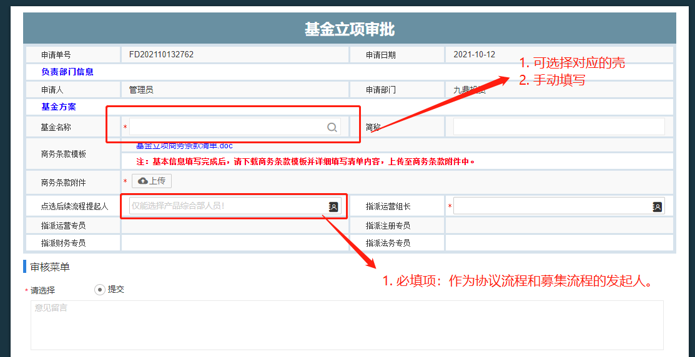

# 基金管理
2021-09-15 10:15:13 

模块 | 前置流程 | 流程 | 后置流程 | 相关报表
---|---|---
[基金规模](#jjgm)|--|[基金规模数据变更](#jjgmsjbglc)|--|基金规模查询
数据中心|[分红登记](#fhdj)|[直投项目填报](#ztxmtb)|[直投项目更新](#ztxmgx)|---
数据中心|[退出登记](#tcdj)|[间投项目填报](#jtxmtb)|---|---
[基金档案](#jjda)|[分红登记](#fhdj)、[退出登记](#tcdj)|[投资收益分配](#tzsyfp)||
|---|[通告函发放](#tghff)||-
|---|[任务发放](#rwff)||-
|---|[非项目划款](#fxmhk)||-
|---|[退出登记](#tcdj)||-
|---|[分红登记](#fhdj)||-
|---|[函件审批](#hjsp)||函件审批流程查询
|---|[常规基金变更](#cgjjbg)||---
|---|[基金立项](#jjlx)||---
|---|[基金设立协议审批](#jjslxysp)||---
|---|[基金募集](#jjmj)||---
|---|[基金认购](#jjrg)||---
|门户网站|[合格投资者认证-自然人](#hgtzzrz-zrr)||---
|门户网站|[合格投资者认证-机构](#hgtzzrz-jg)||---
|门户网站|[合格投资者认证-产品](#hgtzzrz-cp)||---
|---|[基金转让申请](#jjzrsq)||---
|基金转让申请|[风险揭示书](#fxjss)||---

		
##1. 基金规模 
	* 菜单： 
		- 说明：
			* 增（Create）：数据导入
				1. 历史数据导入
				2. 新增数据导入

				* 删（Delete）：
				* 改（Update）：
					1. 基金规模数据变更进行更新；
				* 查（Read）：
					1. 报表：基金规模查询
###1.1. 基金规模数据变更 
>1. 完成基金对应出资人基金规模的相关数据的更新
>2. 记录出资人规模变更前后的数据；

		2021-09-17 11:09:08 
		* 菜单： 
	-说明：
		* 启动：
		* 功能：
			1. 通过数据字典 选择 对应基金；
			2. 点击‘提取变更明细’按钮 　获取变更数据（支持导入导出数据）
			3. 流程结束：更新基金规模档案数据（可再档案检阅）
			4. 表单中：基金规模变更明细可更新；基金规模变更前数据不可编辑。
 
---
##2. 数据中心
>1. 基金‘直’投项目现金流 数据填报及更新  
>2. 基金‘间’投项目现金流 数据填报及更新 

###2.1. 直投项目填报 
> 记录每月基金投项目的现金流数据

	* 菜单：
	* 流程部分环节：
	* 权限： 
     	job（每月1号）-发起流程至
        1. （部分）基金财务专员
        2. （部分）管理公司会计
        3. 
> 说明及注意事项

* 操作说明：
    1. 根据基金编码及项目简称初始化相关基础数据 
    2. 保存之后自动计算 折算人民币金额
    3. 校验：基金财务编码在档案是否存在，并提示；
             项目简称在档案是否存在，并提示。
    4. 流程结束 同步数据到直投档案
         动态从档案获取（若为空 默认 在管）。
        * 基金状态 （根据财务编码获取）
        * 单个项目基金状态 （根据财务编码和 项目简称获取）
        * 项目整体状态（根据项目简称获取）
* 表单结构说明：
	1. 

> 常见问题记录
	
	* 常见问题及流程优化记录
		1. 
	* 关联流程：

###2.2. 间投项目填报 
	
	- 参考直投项目填报 说明

###2.3. 直投项目更新 

	- 说明：更新填报的错误|历史数据。
    - 启动：报表中 财务专员 手动发起
    - 说明及注意事项
		* 操作说明：
			1. 流程结束通知：许琴英、席阳；2021-10-09 9:43:36 
		* 表单结构说明：
			- 
    
---
##3. 基金
###3.1 基金档案 2021-09-18 16:01:41 
> 基金相关信息的维护及数据汇总。

		* 菜单：
		* 流程环节：
			
		* 权限：  
> 说明及注意事项

* 操作说明：
	 
* 表单结构说明：
	1. 子表：
		*  基金定期报告：2021-09-22 17:11:47 
			1. 手动上传附件 或 来自[<u>**任务发放**</u>](#rwff)流程。
			2. 契约型基金需要发 基金定期报告之基金月报。
			3. 定期报告类型：月报|季报|半年报|年报
		* **基金出资人**
			1. 账户是否冻结：关联**投资收益分配流程**-基金运营专员上传收款账号环节，如果存在冻结状态为‘是’ 系统提示并更新分配金额为 0；
			2. 数据来源：**认购流程**（系统自动创建数据） | **受让流程**（客服部手动添加）
			3. 认缴金额：
			   实缴金额：（待反馈。2021-10-08 16:07:10 ）
		*  基金快报
			1. 快报类型：投资|分红|业绩补偿|退出|申报|上市|过会|其他
			2. 手动上传附件 或 来自[<u>**任务发放**</u>](#rwff)流程。
		* 函件类
			1. 函件类型：会议纪要|沟通函|反馈函|说明函|其他
			2. 手动上传附件 或 来自 [<u>**任务发放**</u>](#rwff)流程。
						
 

###3.2 通告函发放
> 1. 完成函件的制作及外发（邮件和短信）到客户 及 客户经理

		* 菜单：基金管理-基金运营管理-通告函发放
		* 流程环节：
		* 权限： 运营专员手动发起
	- 说明及注意事项
		* 操作说明：  
				- 提取数据
				- 制作文件（仅需点一下即可，如果出资人明细太多，建议删除一部分 先测试一下文档是否能制作成功）
						* 文档制作失败：
						1. 上传的模板 需为最终版（接受所有修订）。
						2. 文件标题 不能存在特殊字符；
						3. 文档制作制作过程一般不会超过10分钟。
						4. 制作完成之后：任意抽查几个制作完成的文件是否制作成功；
						5. 任制作失败 请联系管理员；
				- 邮件测试 短信测试
						1. 邮件是否发送成功，可登录网页版邮箱 查看已发送；
						2. 短信是否发送成功，如果显示发送失败，可联系管理员确认；
						* 邮件发送失败：
							1. 查看邮箱密码是否正确（如：密码是否有空格）。
		* 表单结构说明：
				1. 模板类型明细中的附件可以是单个或多个；
				2. 是否后台制作：
					* 是 ：点击文件制作，等大约10分钟或等短信通知；
					* 否 ：直接点击文件制作即可；
			
		* 项目名称及编码可为空：因本次分配的金额 可能不对应项目（例：返税和账存）
	- 总结
	
###3.3 投资收益分配
> 完成对 基金对出资人的 分配方案的审核及划款

	* 菜单：
	* 流程环节：部分环节
		1. 财务专员上传分配方案
		2. 运营专员上传收款账户（2021-09-27 9:37:37 不在上传，改为确认）--基金运营专员确认收款账户
		3. 运营确认外发分配函
		4. 财务专员上传划款指令
		5. 行政盖章
		6. 财务专员划款
	* 权限：
		1. 手动发起：一般为项目清算 或 补充分配
		2. 系统弹出：
			- 分红登记流程
			- 退出登记流程
			- 投资收益分配流程（母子基金）
> 说明及注意事项

* 表单结构说明：
	1. 投资收益分配表-分配明细 可导入导出；
	2. 如本次分配的基金已移交，可点击又上角的 ’转办‘ 按钮，进行移交；
	3. 查看详情：可以查询原始单据（分红、退出、母基金分配流程）
	4. 分配明细中若子基金不需要向下分配： 主体类型 从基金修改为出资人；
	5. 分配明细中包括 支付给管理公司的管理报酬；
	6. 分配明细 若新增数据 根据出资人投资类型 选择相应的数据。
* 后台逻辑说明：
	1. 财务专员上传分配方案 环节 自动计算 **分配说明标题**下信息,（其中包括管理报酬计提方式，计算逻辑见红色字体）
	2. 收款账户信息逻辑更新。2021-09-18 14:48:08
			- 自然人和机构账户信息 从 出资人档案获取
				1. 管理公司作为机构投资的基金 也会在出资人档案建档。
				2. 无论是自然人还是机构 都可能同时投一支或多支基金。
			- 子基金账户信息 从 
			- 账号明细 标识为 收款账号中获取。
			- 账户信息变更需通过 出资人基本信息变更流程进行更新。
	3. 基金财务专员复核环节办理后：**初始化分配明细中账户**相关信息；
	4. 投资收益分配表-分配明细：主体类型基本信息从已投企业获取，**账户信息**（出资人通过主体编码再档案查询，管理公司通过投资主体再档案查询）

> **常见问题记录**

		1. 调整流程到上传划款指令环节？
			如果流程在 基金财务执行划款 环节  审核菜单选择 驳回 办理即可。
	- 相关：
		1. 分红登记流程
		2. 退出登记流程
		3. 投资收益分配流程 
		4. 基金档案-账户信息
		5. 出资人档案（自然人、机构）-账户信息
		
---
###3.4 投资收益合并分配
> 完成一次性对某一支基金的汇总分配；

		* 菜单：投资收益合并分配
		* 流程环节：单节点流程
		* 权限：财务专员
	- 说明及注意事项
		* 操作说明：
			1. 数据字典选择 基金信息
			2. 参考录入选择 原投资收益分配单据 （仅能选取 状态=正常 的单据）
			3. 扩展按钮点击 ‘获取分配明细’ --待优化
			4. 办理后 更新原单据 状态=合并 、关闭原分配流程 同时系统启动一个新收益分配流程。
		* 表单结构说明：
			- 
	- 总结
		* 
	- 相关
		* 投资收益分配流程

---

###3.5 基金移交流程
>完成基金对应专员的交接工作

	* 菜单：基金管理-基金-基金移交
	* 启动权限（手动发起）：运营 注册 财务 专员
	* 使用说明：
		1. 选择交接的（运营、注册、财务、出纳）专员。
			* 专员不需要变更的可为空。
		2. 选择需要移交的基金
			* 点击参考录入-选择基金
	* 审批环节：
		> 申请 -调出部门经理/组长 - 调入部门经理/组长 - 接收人
		1. 同部门直接交接仅部门负责人同意即可
	* 注意：
		1. 多支基金交接给不同的人 目前需提交多支移交流程进行审批
		
---
###3.6 任务发放
> 完成对LP和客户经理相关材料的催缴工作

		* 菜单：任务发放
		* 流程部分环节：
			1. 运营专员提交数据
			2. 估值报告组审核
			3. 信息发送: 审核菜单选择 重新制作 办理流程可驳回到开始环节；
		* 权限： 基金运营专员
> 说明及注意事项

---
* 操作说明：
	1. 通过字典 选择基金信息
	2. 点击按钮 **‘提取数据’** （数据来自基金档案-出资人名录）
		* 提取数据不全：出资人名录中没有。
			a. 认购流程未结束。
			b. 受让流程未完成工商变更。
	3. 点击按钮**制作文件**
		* 点击制作之后最多等10分钟 如制作不成功可咨询同事或管理员
	4. 点击 邮件/短信按钮 进行测试	
	5. 如果需归档 模板文件 在流程结束后 自动归档到基金档案。	
		* 仅支持定期报告和托管报告同时归档，其他只允许单一归档。	
	6. 流程结束 外发邮件及短信通知  和 模板文件归档。
		 * 根据归档类型和文件标题 模板文件同步到基金档案；
* 表单结构说明：
	1. 催缴类型
	2. 归档类型
		a. 注意事项：文件归档 托管报告 必须含有“托管报告”字样才可以归档！
	3. 是否发送： 指是否要发送 邮件附件。
	4. 是否包含模板附件： 指是否需要发送 模板制作之后的附件.
	
---
> 常见问题记录
	
* 常见问题及流程优化记录
	1. **客户反馈邮件未收到?**
		* 登录自己的网页版邮箱，查看已发送邮件确认是否发送成功。
		* 表单中 是否发送状态 是否选择正确。	
		* 确认客户邮件是否正确。
		* 如果客户急要，可通过自己邮箱单独发送即可（下次注意一下通过流程外发是否可以发送成功）。
* 关联流程：
		* 基金档案-出资人名录

---
###3.7 非项目划款
> 完成基金的一些款项的支出业务。

		* 菜单：
		* 流程环节：
			1. 基金财务复核-基金档案维护的财务复核岗
		* 权限：  
	- 说明及注意事项
		* 操作说明：
			- 
		* 表单结构说明：
			- 
	- 总结
		* 
		
	- 相关

###3.8 退出登记
> 完成某个项目的退出，分配策略的审批工作

		* 菜单：
		* 流程环节：
		* 权限： 投后专员

> 说明及注意事项

* 表单结构说明：
	1. 通过字典 选择本次退出的项目信息
	2. 点击扩展按钮 ‘提取’  获取退出中的明细信息；
				* 提取信息不全 可以联系管理员； 
	
* 后台逻辑说明：
	1. 提取逻辑：基本信息来自已投企业档案、账户信息来自基金档案
	2. 申请人确认环节：办理后 同步数据到 直投现金流填报流程中；（如存在流程 则直接新增数据。若无现金流填报，则系统发起流程）
		
> 常见问题记录
	
	* 常见问题及流程优化记录
		1. 
	* 关联流程：
		1. 项目直投基金现金流

###3.9 分红登记
> 介绍

	* 菜单：
	* 流程部分环节：
	* 权限：
		  
> 说明及注意事项

* 表单结构说明：
	1. 
* 后台逻辑说明：
	1. 

> 常见问题记录
	
	* 常见问题及流程优化记录
		1. 
	* 关联流程：
		1. 项目直投基金现金流
###3.10 函件审批

###3.11 常规基金变更
> 完成基金类型的变更（延期、转让、注册地、委派代表（含执行事务合伙人） 、管理人、名称、退出）的材料准备的审核工作及线下工商局变更工作。

		* 菜单：常规基金变更
		* 流程部分环节：
			1. （可选）管理公司财务经理审核（根据是否涉及管理公司判断）
		* 权限：  
> 说明及注意事项

* 操作说明：
	1. 
* 表单结构说明：
	1. （转让方或受让方）**是否涉及管理公司**：是流程结束 发流程通知
	到（杜红霞）。
	2. 变更类型包括转让： 显示转让方、受让方明细；
		* 出让方： 基金档案-出资人名录
        * 受让方： 受让流程（待客户网站确认后启动的受让流程）
	3. 
> **常见问题记录**
	
	* 常见问题及流程优化记录
		1. 新增审核节点：管理公司财务经理审核。2021-10-12 14:31:21 
		2. 选不到基金？
			* 判断基金性质 是否为实体基金。若为壳基金 可联系管理员建档。
		3. 管理公司之间的转受让在系统上如何操作？
			* 即是管理公司又是管理人，直接走内部基金认购流程。
			* 是管理公司不是管理人，同外部出资人一样，先认证、再申请，最后受让；
	* 关联流程：
	 	
###3.12 基金立项	 
> 完成商务条款的审核 及 指派对应负责的专员

	* 菜单：基金立项
	* 流程部分环节：
		1.  提交立项申请
		2.  指派组长
		3.  相关负责人确认
		4.  产品市场部负责人审批
		5.  合规部审核
		6.  客户中心负责人
	* 权限：
		1. 产品市场部 发起；
		  
> 说明及注意事项

* 表单结构说明：

	1. 基金名称： 手动填写 或 选择对应的壳
	2. 点选后续流程提起人：  协议流程 和 募集流程
	3. 上传基金立项商务条款清单
	4. 各部门负责人 指派 负责本基金的专员。
* 后台逻辑说明：
	1. 流程结束：启动**基金设立协议审批流程**和**募集流程**；
	
> 常见问题记录

	* 常见问题及流程优化记录
		1. 
	* 关联流程：
		1. 基金设立协议审批流程
		2. 基金募集流程
	 
###3.13 基金设立协议审批	 

###3.14 基金募集	

###3.15 基金认购	  
> 完成出资人认购工作

	* 菜单：无
	* 流程部分环节：
		1. 客户经理
		2. 客户回访和判断是否寄出认购协议
		3. 合格材料盖章
		4. 合规材料归档
		5. GP出纳确认保证金到账
		6. 认购协议寄出
		7. 注册组收集 工商材料
		8. 工商材料盖章
		9. 注册填写工商变更时间
		10. 工商材料归档
	* 权限：定时器 系统启动
		  
> 说明及注意事项

* 操作说明：
	1. 认购协议寄出 办理后 
		* 同步数据到基金档案-基金出资人名录 
		* 在浪潮系统创建信息
		* 创建出资人档案
	2. 点击 客户名称  可链接 到出资人合格认证流程。
* 表单结构说明：
	1. 出资人签署资料 包括（附件1风险调查问卷、附件2投资者基本信息表、附件3合格投资者承诺函、附件4风险不匹配警示函及投资者确认函、附件5私募基金风险揭示书、附件6个人税居民身份证、附件7控制人税收居民身份证、附件8认购协议。）

> 常见问题记录
	
	* 常见问题及流程优化记录
		1. 流程专员跳转不正确？
			* 确认基金档案 专员是否维护正确。（若正确，可联系管理员查找原因）
	* 关联流程：

###3.16 合格投资者认证-自然人	
> 获取门户LP认证数据，在BPM中进行证件审核；

	* 菜单：
	* 流程部分环节：
		1. 客户经理确认
		2. 产品经理审核
	* 权限：
		  
> 说明及注意事项

* 表单结构说明：
	1. 
* 后台逻辑说明：
	1. 数据抓取  
        定时器抓取（获取投资人门户认证信息） 每10分钟执行一次 ---生成认证流程
	2. 待办到 产品经理审核 环节 是否可以后台驳回，或流程已结束 是否可以激活流程？
		建议客户从门户网站重新认证。
	3. 办理前：更新门户审核状态，创建客户档案，短信通过LP审核结果。
	4. 校验：if（审核通过 && 认购类型==转让）{启动基金转让申请流程} --已取消。

> 常见问题记录
	
	* 常见问题及流程优化记录
		1. 
	* 关联流程：

###3.17 合格投资者认证-机构	

###3.18 合格投资者认证-产品	

###3.19 基金转让申请
>1. 对已出资的LP申请基金份额的转让。
>2. 对受让方（通过合格认证、资产证明）资料进行审核，完成风险揭示书的制作。
>3. 目前流程仅支持一对一转让（因客户经理不同，业务不易操作）；
>4. 客户经理手动发起 | 合格认证流程启动

	* 菜单：
	* 流程部分环节：
	* 权限：
		  
> 说明及注意事项

* 表单结构说明：
	1. 需选择 是否制作 《风险揭示书》
	2. 选择 转让方信息。
* 后台逻辑说明：
	1. 根据是否制作 《风险揭示书》 判断 是否启动子流程（风险揭示书制作）流程。
	2. **数据处理节点**: 更新网站转让单的状态 客户可从门户网站选择到本单据 进行下一步受让工作。
	3. 选择转让方信息 ，信息来自 出资人名录。

> 常见问题记录
	
	* 常见问题及流程优化记录
		1. 
	* 关联流程：

###3.20 风险揭示书
>1.  完成风险揭示书的制作工作

##6.基础数据
###6.1 开户行维护
>开户行信息维护

	* 菜单： 基金管理-基础数据-开户行数据查询及维护
		* 权限： 数据有组长进行维护
	- 相关
		*  基金档案-账户信息
	

